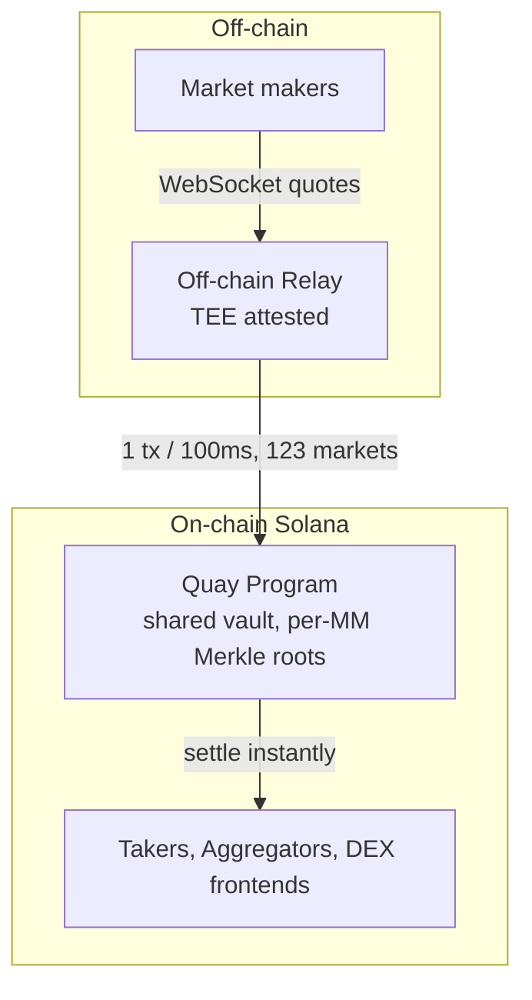

# Quay Markets

**Decentralized Exchange for Internet Capital Markets.**

Professional liquidity on permissionless rails. On Solana.

[**quay.markets →**](https://quay.markets)

---

## What Internet Capital Markets need

- **Tight spreads** — competitive with centralized venues
- **Permissionless MMs** — no gatekeeping by infra cost or relationships
- **Hundreds of pairs** — near-zero cost to quote a new market
- **Capital efficient** — shared collateral, not locked per-pair
- **Low LP/MM risk** — protection from toxic flow, not guaranteed losses

## How Quay solves it

Prop AMM is the closest model to what Internet Capital Markets need. Quay keeps everything that works and fixes what doesn't.

### Permissionless Quoting
Any market maker can start quoting any pair instantly — no onboarding, no infra setup. Router integrations (Jupiter, DFlow, Titan) are built in from day one.

### Batched Quote Streaming
Batched quotes drive the cost of quoting a market from **$100–1,000/day to $1–10/day**.

### Settlement Vault
LPs deposit USDC, SOL, ETH, BTC and other assets into a shared vault and earn trading fees. MMs use these deposits for instant settlement — only USDC collateral required, trading at 3–20× collateral size.

---

## Architecture

---

[quay.markets](https://quay.markets) · Built on Solana